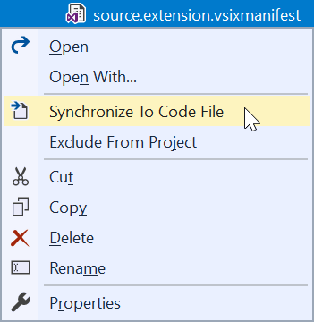
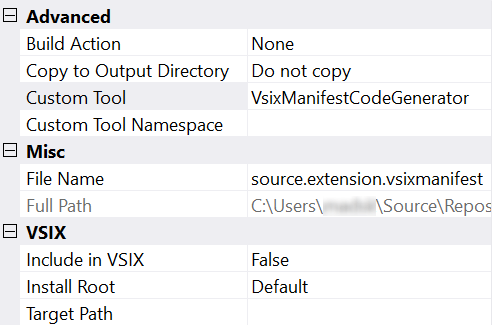
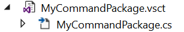

# VSIX Syncronizer

[](https://ci.appveyor.com/project/madskristensen/vsixsynchronizer)

Provides the ability to generate code-behind files for .vsixmanfiest and .vsct files in managed code to make the information easy to consume from the rest of the extension.

Download this extension from the [Open VSIX Gallery](http://vsixgallery.com/extension/d7834c28-6a0f-4b5a-b3e0-735dc78cd439/).

---------------------------------------

To enable the syncronization of .vsct and/or .vsixmanifest files, simply right-click the file in Solution Explorer and hit **Syncronize To Code File**.



This will set the Custom Tool property on the file as shown here in the Property Grid:



It will apply the *VsctCodeGenerator* for .vsct files and *VsixManifestCodeGenerator* to .vsixmanifest files.

A code-behind file is then being generated and kept up-to-date with any changes to the .vsct or .vsixmanifest files.



## Generated code-behind files 
The code being generated are C# classes that compiles like regular C# files into your project. Here's examples of what those classes would look like:

### .vsct files

```c# 
// ------------------------------------------------------------------------------
// <auto-generated>
//     This file was generated by VSIX Syncronizer
// </auto-generated>
// ------------------------------------------------------------------------------
namespace VsixSynchronizer
{
    using System;
    
    /// <summary>
    /// Helper class that exposes all GUIDs used across VS Package.
    /// </summary>
    internal sealed partial class PackageGuids
    {
        public const string guidPackageString = "8c737258-7da1-4314-97e9-cb61f7cf8d22";
        public static Guid guidPackage = new Guid(guidPackageString);

        public const string guidUIContextString = "f19443c0-4f6b-45c3-bea5-80c1f8a538dd";
        public static Guid guidUIContext = new Guid(guidUIContextString);

        public const string guidVsixSynchronizerCmdSetString = "c6562423-a610-432a-8efa-ca46df10ddd6";
        public static Guid guidVsixSynchronizerCmdSet = new Guid(guidVsixSynchronizerCmdSetString);
    }
    /// <summary>
    /// Helper class that encapsulates all CommandIDs uses across VS Package.
    /// </summary>
    internal sealed partial class PackageIds
    {
        public const int ToggleVsctSyncId = 0x0200;
    }
}
```

### .vsixmanifest files

```c#
// ------------------------------------------------------------------------------
// <auto-generated>
//     This file was generated by VSIX Syncronizer
// </auto-generated>
// ------------------------------------------------------------------------------
namespace VsixSynchronizer
{
    internal sealed partial class Vsix
    {
        public const string Id = "d7834c28-6a0f-4b5a-b3e0-735dc78cd439";
        public const string Name = "VSIX Synchronizer";
        public const string Description = @"Provides the ability to generate code-behind files for .vsixmanfiest and .vsct files in managed code to make the information easy to consume from the rest of the extension.";
        public const string Language = "en-US";
        public const string Version = "1.0";
        public const string Author = "Mads Kristensen";
        public const string Tags = "vsix, vssdk";
    }
}
```

Now you can consume those GUIDs and IDs from the .vsct files and the metadata about your extension from the .vsixmanifest files.

## License
[Apache 2.0](LICENSE)